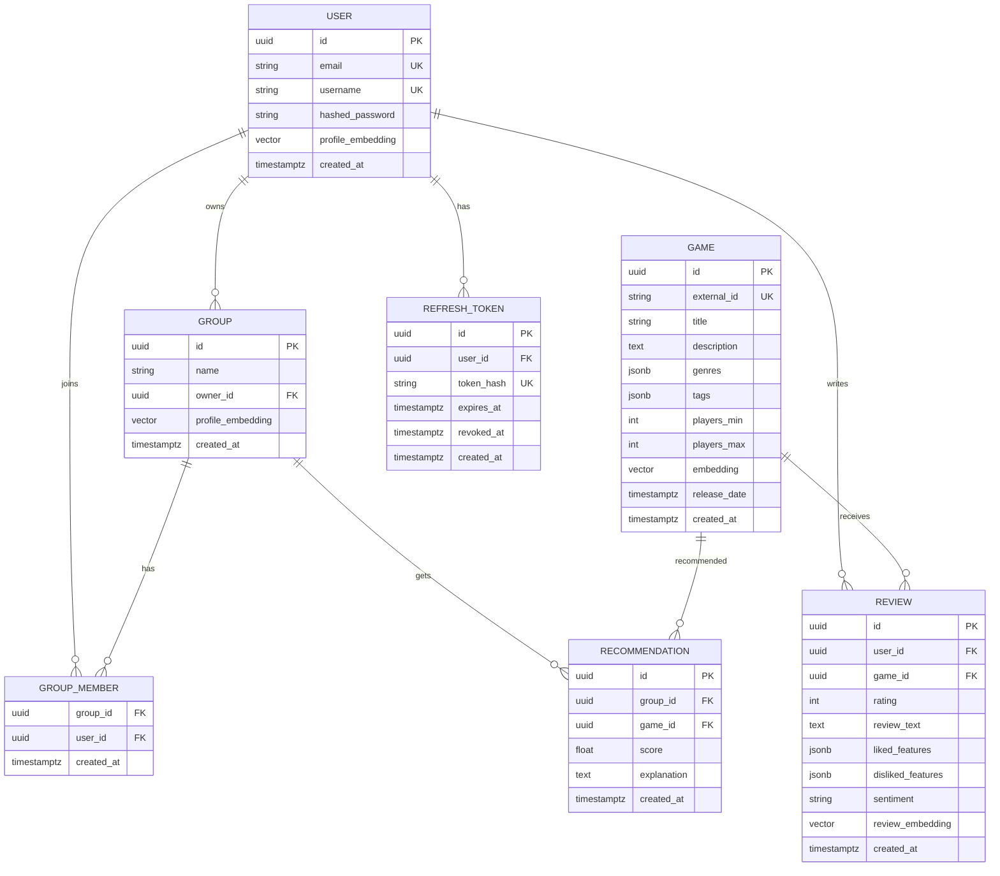

# Cooperative Games Recommendation Platform MVP

## Product Architecture

The MVP is a monorepo with two applications:

- `apps/api`: FastAPI backend with Clean Architecture boundaries, SQLAlchemy 2.0, Alembic, JWT auth, pgvector-backed similarity search, and AI analysis interfaces.
- `apps/web`: Next.js 15 frontend with TypeScript, App Router, TailwindCSS, and shadcn/ui-style primitives.

### Backend Layers

- `domain`: framework-free entities, enums, and domain rules.
- `application`: use cases and services such as authentication, AI analysis, profile generation, and recommendations.
- `infrastructure`: SQLAlchemy models, database session management, repositories, and provider implementations.
- `api`: FastAPI routers, request/response schemas, dependency injection, and OpenAPI surface.

### Recommendation Flow

1. A user writes a review for a game.
2. The AI service extracts `liked_features`, `disliked_features`, `sentiment`, and a review embedding.
3. The user profile is derived from the average of that user's review embeddings.
4. The group profile is derived from the average of group member user embeddings.
5. Candidate games are ranked by cosine similarity between `group_embedding` and `game.embedding`.
6. The AI service generates a concise explanation for each recommendation.
7. Recommendations are persisted for dashboard retrieval.

For local MVP development, the AI module exposes deterministic fallback behavior. Production can replace it with an OpenAI-compatible provider without changing use cases.

## Project Structure

```text
.
├── apps
│   ├── api
│   │   ├── alembic
│   │   │   ├── env.py
│   │   │   └── versions
│   │   ├── app
│   │   │   ├── api
│   │   │   │   └── v1
│   │   │   │       └── routers
│   │   │   ├── application
│   │   │   │   └── services
│   │   │   ├── core
│   │   │   ├── domain
│   │   │   ├── infrastructure
│   │   │   │   ├── db
│   │   │   │   └── repositories
│   │   │   ├── schemas
│   │   │   └── tests
│   │   └── scripts
│   └── web
│       ├── app
│       ├── components
│       │   └── ui
│       ├── features
│       │   ├── auth
│       │   ├── dashboard
│       │   ├── games
│       │   ├── groups
│       │   └── recommendations
│       └── lib
├── docs
├── examples
└── infra
```

## ER Diagram



## OpenAPI Endpoints

Base path: `/api/v1`

### Auth

- `POST /auth/register`: create user and token pair.
- `POST /auth/login`: authenticate by email/password.
- `POST /auth/refresh`: rotate access token from refresh token.
- `GET /auth/me`: return authenticated user.

### Groups

- `POST /groups`: create a group owned by the current user.
- `GET /groups`: list current user's groups.
- `GET /groups/{group_id}`: group details with members.
- `POST /groups/{group_id}/invite`: invite/add user by email.

### Games

- `POST /games`: add a game and generate its embedding.
- `GET /games`: list games.
- `GET /games/{game_id}`: game details.

### Reviews

- `POST /reviews`: create review, run AI analysis, update user profiles.
- `GET /reviews/me`: current user's reviews.
- `GET /games/{game_id}/reviews`: reviews for a game.

### Recommendations

- `POST /groups/{group_id}/recommendations/generate`: update group profile and generate recommendations.
- `GET /groups/{group_id}/recommendations`: list saved recommendations.

### External / Steam

- `GET /external/steam/search?q=<query>`: search Steam store by name, returns lightweight results (id, name, thumb).
- `POST /external/steam/import`: import a Steam app by numeric id into the local games table.

### Dashboard

- `GET /dashboard`: current user's groups, recent reviews, and recommendations.

## SQL Schema

```sql
CREATE EXTENSION IF NOT EXISTS vector;

CREATE TABLE users (
    id uuid PRIMARY KEY,
    email varchar(320) NOT NULL UNIQUE,
    username varchar(80) NOT NULL UNIQUE,
    hashed_password varchar(255) NOT NULL,
    profile_embedding vector(8),
    created_at timestamptz NOT NULL DEFAULT now()
);

CREATE TABLE groups (
    id uuid PRIMARY KEY,
    name varchar(120) NOT NULL,
    owner_id uuid NOT NULL REFERENCES users(id) ON DELETE CASCADE,
    profile_embedding vector(8),
    created_at timestamptz NOT NULL DEFAULT now()
);

CREATE TABLE refresh_tokens (
    id uuid PRIMARY KEY,
    user_id uuid NOT NULL REFERENCES users(id) ON DELETE CASCADE,
    token_hash varchar(128) NOT NULL UNIQUE,
    expires_at timestamptz NOT NULL,
    revoked_at timestamptz,
    created_at timestamptz NOT NULL DEFAULT now()
);

CREATE TABLE group_members (
    group_id uuid NOT NULL REFERENCES groups(id) ON DELETE CASCADE,
    user_id uuid NOT NULL REFERENCES users(id) ON DELETE CASCADE,
    created_at timestamptz NOT NULL DEFAULT now(),
    PRIMARY KEY (group_id, user_id)
);

CREATE TABLE games (
    id uuid PRIMARY KEY,
    external_id varchar(120) UNIQUE,
    title varchar(200) NOT NULL,
    description text NOT NULL,
    genres jsonb NOT NULL DEFAULT '[]'::jsonb,
    tags jsonb NOT NULL DEFAULT '[]'::jsonb,
    players_min integer NOT NULL,
    players_max integer NOT NULL,
    embedding vector(8),
    release_date timestamptz,
    created_at timestamptz NOT NULL DEFAULT now()
);

CREATE TABLE reviews (
    id uuid PRIMARY KEY,
    user_id uuid NOT NULL REFERENCES users(id) ON DELETE CASCADE,
    game_id uuid NOT NULL REFERENCES games(id) ON DELETE CASCADE,
    rating integer NOT NULL CHECK (rating >= 1 AND rating <= 10),
    review_text text NOT NULL,
    liked_features jsonb NOT NULL DEFAULT '[]'::jsonb,
    disliked_features jsonb NOT NULL DEFAULT '[]'::jsonb,
    sentiment varchar(32) NOT NULL DEFAULT 'neutral',
    review_embedding vector(8),
    created_at timestamptz NOT NULL DEFAULT now(),
    UNIQUE (user_id, game_id)
);

CREATE TABLE recommendations (
    id uuid PRIMARY KEY,
    group_id uuid NOT NULL REFERENCES groups(id) ON DELETE CASCADE,
    game_id uuid NOT NULL REFERENCES games(id) ON DELETE CASCADE,
    score double precision NOT NULL,
    explanation text NOT NULL,
    created_at timestamptz NOT NULL DEFAULT now(),
    UNIQUE (group_id, game_id)
);

CREATE INDEX ix_games_embedding_cosine
    ON games USING ivfflat (embedding vector_cosine_ops)
    WITH (lists = 100);

CREATE INDEX ix_reviews_user_id ON reviews(user_id);
CREATE INDEX ix_recommendations_group_id ON recommendations(group_id);
```

## MVP Constraints

- Embedding dimension is `8` for fast local development and readable tests. It is configured by `EMBEDDING_DIM`.
- The default AI provider is deterministic and local. It can be swapped for a real LLM provider through the `AIService` interface.
- Invite flow directly adds an existing user by email. Email delivery is outside MVP scope.
- Refresh tokens are stored as hashed values in the database and can be rotated later; the MVP validates active tokens.
